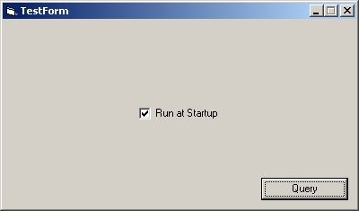



## run at startup checkbox

### Description

(Update:Fixed Default UserControl Propities) Allows your app to run when windows starts using the registry not the startup menu folder. This checkbox control supports command line arguements, forecolor, backcolor, font, left/right alignment, all the things you expext from a regular checkbox. Please comment.
 
### More Info
 

             |
---                |---
**Submitted On**   |2006-07-27 00:48:24
**By**             |[Jason Curtius](https://github.com/Planet-Source-Code/PSCIndex/blob/master/ByAuthor/jason-curtius.md)
**Level**          |Beginner
**User Rating**    |5.0 (10 globes from 2 users)
**Compatibility**  |VB 6\.0
**Category**       |[Custom Controls/ Forms/  Menus](https://github.com/Planet-Source-Code/PSCIndex/blob/master/ByCategory/custom-controls-forms-menus__1-4.md)
**World**          |[Visual Basic](https://github.com/Planet-Source-Code/PSCIndex/blob/master/ByWorld/visual-basic.md)
**Archive File**   |[run\_at\_sta2008927262006\.zip](https://github.com/Planet-Source-Code/jason-curtius-run-at-startup-checkbox__1-66030/archive/master.zip)

